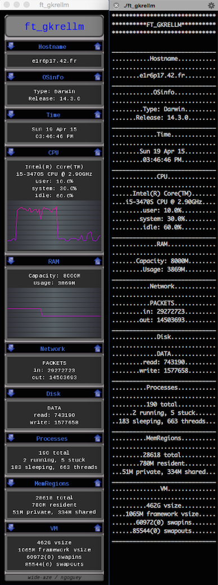

# Piscine CPP rush#01 FT_GKRELLM, Apr 2015
>>>>> #####Ncurse+sfml resources monitor. (group project)

#####Grade ``(TBD/125)`` ``(TBD/125)*``
--------  -----------------------

Team: [wide-aze](https://github.com/wide-aze) / [ngoguey](https://github.com/Ngoguey42).

Install and launch (mac os x):
```sh
git clone https://github.com/Ngoguey42/ft_gkrellm.git
cd ft_gkrellm
make sfml all
DYLD_FRAMEWORK_PATH=`pwd`"/SFML/Frameworks" ./ft_gkrellm
```

### Classes:
```cpp

namespace ft;
class IMonitorDisplay; //Interface, base class for ftsf::Window and ftnc::Window
class IMonitorModule; //Interface
class TimeModule : public IMonitorModule;
class CPUModule : public IMonitorModule;
class DiskModule : public IMonitorModule;
class HostnameModule : public IMonitorModule;
class NetworkModule : public IMonitorModule;
class OSinfoModule : public IMonitorModule;
class RAMModule : public IMonitorModule;
//etc...

namespace ftsf; //ft_sfml
class Window : public ft::IMonitorDisplay, public sf::RenderWindow; // holds the Background and the ftsf::Modules
class Background : public sf::Drawable; //one inside the above Window class
class Module : public sf::Drawable; //one for each ft::IMonitorModule
class RoundedBox : public sf::Drawable; //contains 4xsf::CircleShape and 1xsf::ConvexShape
class DefaultTextBox : public RoundedBox; //contains 1xsf::Text

namespace ftnc; //ft_ncurses
class Window : public ft::IMonitorDisplay;
class Line : public std::string; //one for each line in the terminal
```


<br>
 
<br><br><br><br><br><br><br><br>
